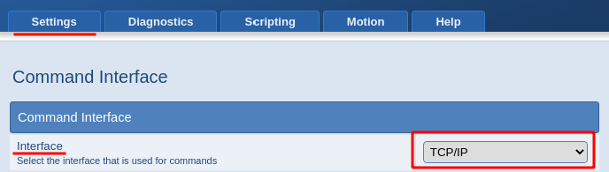
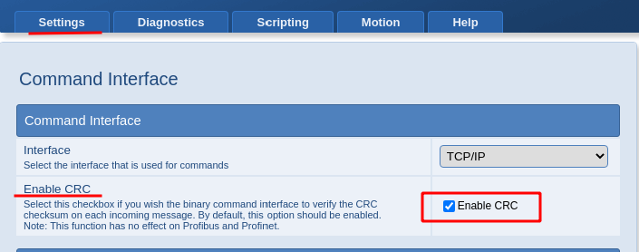
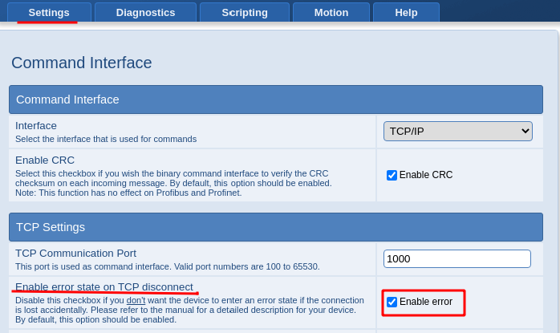

# Schunk WSG50 protocol

## General notes

Regardless of the interface being used, the WSG communicates with its client using binary data packets (except Fieldbus interface).

The data transmission is based on a "little-endian" representation of multi-byte words, where the least significant byte is transferred first.

Following types are possible:

- Floating point - 32 bit single precision floating point numbers:
  
  - sign: D31
  - exponent: D30 - D23
  - mantissa: D22 - D0

- Integer number - 8, 16 or 32 bit numbers
- String - ASCII text without any control characters
- Bit vector (usually flags)
- Enum (integers where every value has a special meaning)

In our case we use **TCP/IP**. To select this interface go to *Web-interface (type IP address of the gripper into the address bar) -> Settings -> Command Interface -> Command Interface -> Interface -> choose TCP/IP in drop-down menu*:

<div style="text-align: center">
    
</div>

All packets start with a preamble signaling the beginning of a new data packet. An identification code describes the content of the packet. It is used as command ID and distinguishes the several commands of the device. The two-byte size value determines the size of the packet’s payload in bytes. A two-byte CRC checksum is added to each packet to verify data integrity. To check a received message, you have to calculate the CRC checksum again over the received data frame including preamble and received checksum. If the received data is correct, the calculated checksum is 0.

### Disabled CRC checksum

CRC checksum can be disabled (*Web-interface -> Settings -> Command Interface -> Command Interface -> Enable CRC -> uncheck the checkbox*):

<div style="text-align: center">
    
</div>

Even if checksum evaluation is disabled, the gripper module will always send a valid checksum with its response. The client is responsible for the its evaluation. And also **two-byte checksum field must be present in all messages** (it can take any desired values, gripper module will ignore it).

### Error state on TCP disconnect

If connection is lost then gripper module automatically issues a FAST STOP (it happens if checkbox `Enable error` is checked: *Web-interface -> Settings -> Command Interface -> TCP Settings -> Enable error state on TCP disconnect -> check the checkbox*).

<div style="text-align: center">
    
</div>

## Request to the gripper

| Byte     | Symbol          | Description                                                           |
| -------- | --------------- | --------------------------------------------------------------------- |
| 0..2     | PREAMBLE        | Signals the begin of a new message and has to be AAAAAAh              |
| 3        | COMMAND_ID      | ID byte of the command                                                |
| 4..5     | SIZE_OF_PAYLOAD | Size of the packet’s payload in bytes. May be 0 for signaling packets |
| 6..n     | PAYLOAD         | Payload data                                                          |
| n+1..n+2 | CHECKSUM        | CRC checksum of the whole data packet, including the preamble.        |

**Examples of packets:**

Packet with ID = 1, no payload (size of payload = 0000):
```
AA AA AA 01 00 00 E8 10
```

Packet with ID = 1, two bytes payload (12, 34) (size of payload = 0002), checksum is 666D:
```
AA AA AA 01 02 00 12 34 6D 66
```

## Response from the gripper

| Byte     | Symbol          | Description                                                                                                                                                                                   |
| -------- | --------------- | --------------------------------------------------------------------------------------------------------------------------------------------------------------------------------------------- |
| 0..2     | PREAMBLE        | Signals the begin of a new message and has to be AAAAAAh                                                                                                                                      |
| 3        | COMMAND_ID      | ID of the command                                                                                                                                                                             |
| 4..5     | SIZE_OF_PAYLOAD | Size of the packet’s payload in bytes (**STATUS_CODE size is included**). For example: 2 for a packet with an error code other than E_SUCCESS or 6 for a packet returning E_SUCCESS and a 4-byte command-specific parameter |
| 6..7     | STATUS_CODE     | Status code                                                                                                                                                                                   |
| 8..n     | PAYLOAD         | Command specific parameters. Only available, if the status code is E_SUCCESS                                                                                                                  |
| n+1..n+2 | CHECKSUM        | CRC checksum of the whole data packet, including the preamble.                                                                                                                                |

**Examples of packets:**

Acknowledging a successfully executed command ("Homing", ID = 20) without any return parameters, status code E_SUCCESS = 0000:
```
AA AA AA 20 02 00 00 00 B3 FD
```

Acknowledging a faulty command (command ID = 90 is unknown), the gripper returns E_CMD_UNKNOWN = 000E status code:
```
AA AA AA 90 02 00 0E 00 FD 02
```

Acknowledging a successfully executed command "Read acceleration", which returns a 4 byte floating-point value (here: 150.0 mm/s² or `00 00 16 43`):
```
AA AA AA 30 06 00 00 00 00 00 16 43 DC CB
```

Acknowledging the reception of a pre-positioning command with status code E_CMD_PENDING = 001A:
```
AA AA AA 21 02 00 1A 00 67 CB
```

After the target position was reached, the gripper module sends the result with an additional packet, status code E_SUCCESS = 0000:
```
AA AA AA 21 02 00 00 00 28 04
```

## Usage of wsg_commander on Linux:

To install (if `wsg_commander.exe` is in the current directory):
```
sudo apt -y install wine
wine ./wsg_commander.exe
```

To run (if the user is `alex` and you have used the default installation path):
```
wine '/home/alex/.wine/drive_c/Program Files (x86)/Weiss Robotics/WSG Commander/WSG_Commander.exe'
```

To connect to WSG: *Device -> Connect -> Select Ethernet/TCP (in Device drop-down menu) and TCP (in Port drop-down menu) and press Connect button -> Type IP address and port in the corresponding fields and press OK button*.

`NOTE` WSG Commander closes the connection if checksum received from the WSG or its emulator is invalid.

## Some notes

`0xB1` - position control ID

`0xB2` - speed control ID

Distance between the fingers bytes (in mm):

```
payload[2]
payload[3]
payload[4]
payload[5]
```

Speed between the fingers (relative) bytes (in mm/s):

```
payload[6]
payload[7]
payload[8]
payload[9]
```

Один палец wsg-fmf, второй wsg-f (обычная губка).

Как показывает опыт, палец на определение силы работает так себе. Надо ставить демпфер типа пористой резины, иначе сила между жёстким и жёстким нарастает мгновенно с учетом дискретной обработки.

Есть пределы ожидания выполнения команды Homing (wsg_driver)

Надо решить проблему с утечками памяти. На данный момент убрал все free, поскольку с ними происходит постоянно segmentation fault. Типично на этой строке:

```
response_sequence.responses[0] = response;
```